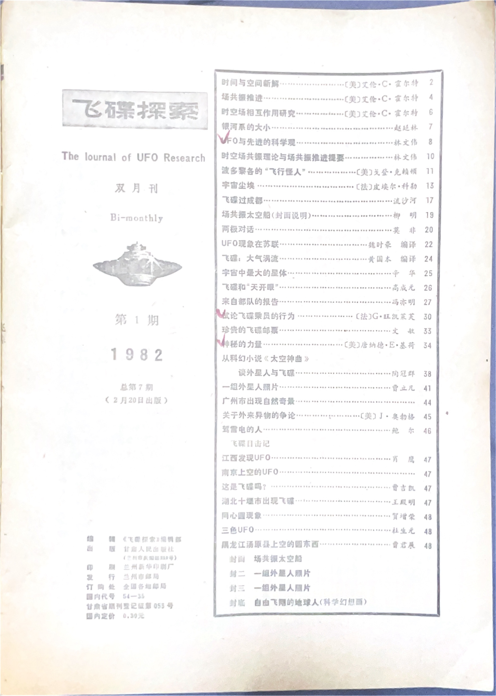
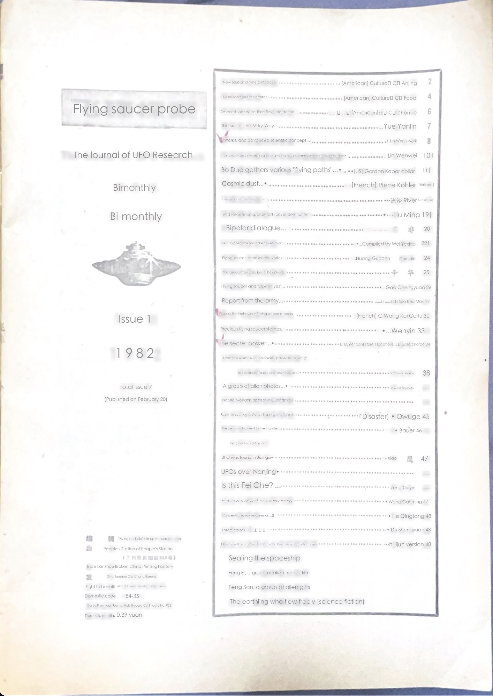

# OCR Server

Turn your iPhone into a powerful local OCR server using Apple's Vision Framework. 
No cloud dependencies, unlimited usage, complete privacy.
Includes translation (currently hardcoded Traditional Mandarin Chinese to English).

[Download from the App Store](https://apps.apple.com/us/app/ocr-server/id6749533041)

**English** | [日本語](README.ja.md) | [繁體中文](README.zh-TW.md) | [简体中文](README.zh-CN.md) | [한국어](README.ko.md) | [Français](README.fr.md)


## How to Use

1. Launch the app and the server will start automatically
2. Access the displayed IP address from any device on the same network
3. Upload images to get text recognition results
4. Integrate the service into your applications via API
5. To ensure the app runs continuously without interruption, please enable iOS [Guided Access](https://support.apple.com/en-us/111795) mode and keep the screen on

- **OCR Test: On your computer, open a web browser and navigate to the IP address displayed by the app to perform an OCR test.**


- **API Example - Upload an image via `upload` API:**

  ```
  curl -H "Accept: application/json" \
    -X POST http://<YOUR IP>:8000/upload \
    -F "file=@01.png"
  ```

- **Python Upload Example:**

  ```python
  import requests

  url = "http://10.0.1.11:8000/upload"  # Replace with your IP address
  file_path = "01.png"

  with open(file_path, "rb") as f:
      files = {"file": f}
      headers = {"Accept": "application/json"}
      response = requests.post(url, files=files, headers=headers)

  print("status code:", response.status_code)
  print("response:", response.text)
  ```

- **The JSON response looks like this:**

  ```json
  {
  "ocr_result": "19B2\nSolar\nSystem\nCygnus X-1\n飞碟探索",
  "ocr_boxes": [
    {
      "translated_text": "19B2",
      "h": 482.6347053050994,
      "y": 13.577584748455148,
      "text": "19B2",
      "w": 446.3641785738761,
      "x": -9.292196731151611
    },
    {
      "translated_text": "Solar",
      "h": 56.24999999999977,
      "y": 1342.968749765625,
      "text": "Solar",
      "w": 168.42105263157896,
      "x": 771.9298259649122
    },
    {
      "x": 807.0175456842103,
      "h": 56.25000000000023,
      "text": "System",
      "translated_text": "System",
      "y": 1392.18749971875,
      "w": 182.45614035087738
    },
    {
      "x": 1683.4274593113935,
      "h": 64.25111666321754,
      "text": "Cygnus X-1",
      "translated_text": "Cygnus X-1",
      "y": 2611.6244414173184,
      "w": 268.2328073601975
    },
    {
      "x": 336.84210442495146,
      "h": 414.84374999999955,
      "text": "飞碟探索",
      "translated_text": "Flying saucer exploration",
      "y": 2700.000001152344,
      "w": 1775.4385964912283
    }
  ],
  "image_width": 2400,
  "image_height": 3375,
  "ocr_translated_zhHant": [
    "19B2",
    "Solar",
    "System",
    "Cygnus X-1",
    "Flying saucer exploration"
  ],
  "message": "File uploaded successfully",
  "success": true
}
  ```
  `ocr_result` shows raw ocr results
  `ocr_boxes` contains:
    `x` and `y` represent the top-left origin of the text bounding box (in px),
    `w` and `h` represent the width and height of the text bounding box (in px).
    `text` original text
    `translated_text` translated text
  `image_width` and `image_height` represent the width and height of the image (in px),
  `ocr_translated_zhHant` full text translation


- **Python Example – Drawing text bounding boxes using `ocr_boxes` information:**

  ```python
  #
  # pip3 install requests pillow opencv-python
  #

  import os
  import sys
  import requests
  from PIL import Image, ImageDraw, ImageFont
  import numpy as np
  import cv2

  url = "http://10.0.1.11:8000/upload"  # Replace with your IP address
  file_path = "01.png"

  # ===== Select font (supports Chinese and English), font size auto-scales with box height =====
  def pick_font(box_h_px: float):
      font_candidates = [
          # macOS
          "/System/Library/Fonts/PingFang.ttc",
          "/System/Library/Fonts/STHeiti Light.ttc",
          # Windows
          r"C:\Windows\Fonts\msyh.ttc",
          r"C:\Windows\Fonts\msjh.ttc",
          r"C:\Windows\Fonts\arialuni.ttf",
          # Noto
          "/usr/share/fonts/opentype/noto/NotoSansCJK-Regular.ttc",
          "/usr/share/fonts/truetype/noto/NotoSansCJK-Regular.ttc",
      ]
      size = max(10, int(box_h_px * 0.25))  # Small font size = 25% of box height (minimum 10pt)
      for path in font_candidates:
          if os.path.exists(path):
              try:
                  return ImageFont.truetype(path, size=size)
              except Exception:
                  pass
      return ImageFont.load_default()

  # ===== Draw box and small text =====
  def draw_boxes(img_pil: Image.Image, boxes, line_thickness: int = 5) -> Image.Image:
      draw = ImageDraw.Draw(img_pil)
      for b in boxes:
          try:
              x = float(b["x"]); y = float(b["y"])
              w = float(b["w"]); h = float(b["h"])
              text = str(b.get("text", ""))
          except Exception:
              continue

          # Red bounding box
          x2, y2 = x + w, y + h
          draw.rectangle([x, y, x2, y2], outline=(255, 0, 0), width=line_thickness)

          # Top-right label
          font = pick_font(h)
          # Text size
          # textbbox returns (l, t, r, b)
          l, t, r, b = draw.textbbox((0, 0), text, font=font)
          tw, th = (r - l), (b - t)
          pad = max(2, int(h * 0.06))

          # Align label to top-right, not exceeding box or image edge
          tx = int(max(0, min(x2 - tw - pad, img_pil.width - tw - pad)))
          ty = int(max(0, min(y + pad, img_pil.height - th - pad)))

          # White background
          draw.rectangle([tx - pad, ty - pad, tx + tw + pad, ty + th + pad], fill=(255, 255, 255))
          draw.text((tx, ty), text, font=font, fill=(20, 20, 20))
      return img_pil

  def main():
      if not os.path.exists(file_path):
          print(f"[ERROR] Image not found: {file_path}", file=sys.stderr)
          sys.exit(1)

      # 1) Upload
      with open(file_path, "rb") as f:
          files = {"file": f}
          headers = {"Accept": "application/json"}
          try:
              response = requests.post(url, files=files, headers=headers, timeout=60)
          except requests.RequestException as e:
              print(f"[ERROR] Request failed: {e}", file=sys.stderr)
              sys.exit(2)

      print("status code:", response.status_code)

      # 2) Check HTTP and JSON
      if response.status_code != 200:
          print("response:", response.text[:500])
          sys.exit(3)

      try:
          data = response.json()
      except ValueError:
          print("[ERROR] Not JSON response")
          print("response:", response.text[:500])
          sys.exit(4)

      if not data.get("success", False):
          print("[ERROR] Server returned failure:", data)
          sys.exit(5)

      print("response ok")

      # 3) Load original image (using PIL)
      img_pil = Image.open(file_path).convert("RGB")

      # If server returns different dimensions (should usually match), use server dimensions
      W = int(data.get("image_width", img_pil.width))
      H = int(data.get("image_height", img_pil.height))
      if (W, H) != (img_pil.width, img_pil.height):
          img_pil = img_pil.resize((W, H), Image.BICUBIC)

      boxes = data.get("ocr_boxes", [])
      img_pil = draw_boxes(img_pil, boxes)

      # 4) Display
      img_cv = cv2.cvtColor(np.array(img_pil), cv2.COLOR_RGB2BGR)
      cv2.imshow("OCR Preview", img_cv)
      print("Press any key on the image window to exit...")
      cv2.waitKey(0)
      cv2.destroyAllWindows()

  if __name__ == "__main__":
      main()
  ```

  Sample Output:

  


- **Advanced Python Example – Drawing text bounding boxes using `ocr_boxes` information and output ocr'ed pdf:**
Install `pip3 install requests pillow opencv-python pymupdf`
Run `python3 ocr-server-example.py`

  Sample input:

  

  Sample Output:

  


## Features

- High-precision OCR powered by Apple’s Vision Framework
- Supports multiple languages with automatic detection
- Upload via web interface and receive OCR results within seconds
- JSON API for easy integration into apps
- 100% local processing, no cloud, full privacy


## Use Cases

- Local OCR without cloud services
- Share OCR services across devices in the same network
- Build an OCR processing cluster using multiple iPhones
